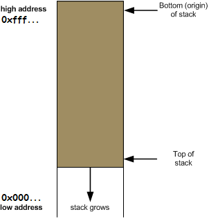

# Return-Oriented Programming (ROP) Explanation

@boodamdang

___

### Tại sao có kỹ thuật tấn công ROP?

Sự xuất hiện của các cơ chế bảo vệ như Non-executable (NX) hay Data Execution Prevention (DEP) giúp chống thực thi code ở vùng nhớ không cho phép. Có nghĩa là khi chúng ta khai thác lỗ hổng Buffer Overflow (BOF) của một chương trình, nếu chương trình này có cơ chế bảo vệ NX hay DEP thì shellcode chúng ta chèn vào xem như vô dụng - bởi vì vùng nhớ lưu shellcode đã bị đánh dấu là không được thực thi.

ROP là một kỹ thuật tấn công tận dụng các đoạn code có sẵn của chương trình (đương nhiên là code của chương trình nằm trong vùng nhớ được phép thực thi) để thực thi những lệnh tương đương với việc thực thi shellcode.

### Để hiểu được ROP là như thế nào, trước tiên chúng ta cần hiểu một số cơ chế quan trọng sau:

#### Cấu trúc của stack trong kiến trúc Intel x86 (cần xem kỹ hình bên dưới để biết stack là như thế nào):

#### Instruction Pointer (IP):  Trỏ tới lệnh đang thực thi trên stack.

#### Stack Pointer (SP): Trỏ tới đỉnh stack (đỉnh ở đây được hiểu là đỉnh của các lệnh - có nghĩa là SP trỏ tới lệnh gần nhất cần phải thực thi).

#### push \<value\>: giảm SP và đẩy \<value\> vào vị trí SP trỏ tới.
  
#### pop \<register\>: lấy giá trị mà SP trỏ tới gán vào \<register\> và tăng SP.

#### call \<function\>:

* push \<return address\> (address của lệnh ngay sau lệnh call \<function\>, tức là lệnh sẽ được thực thi sau khi kết thúc \<function\>) vào stack.

* Gán IP bằng địa chỉ của \<function\>.

#### ret (lệnh ret là mấu chốt của ROP, cần hiểu cơ chế của lệnh pop đã nói ở trên để hiểu rõ lệnh ret):

* pop \<register\>.

* Gán IP bằng giá trị \<register\>.

### Nếu tự tin rằng bản thân đã thấm nhuần được những tư tưởng bên trên, ta đi vào tìm hiểu ROP là như thế nào:

#### Gadget: Chuỗi các lệnh của chương trình kết thúc bằng lệnh ret. Ví dụ như:

* xor eax, eax ; ret

* inc eax ; ret

* pop eax ; pop edx ; pop ebx ; ret

* mov dword ptr [edx], eax ; ret

* …

#### Ý tưởng của ROP là thực thi liên tiếp chuỗi các gadget (mỗi gadget là chuỗi các lệnh assembly) thay vì thực thi shellcode – bởi vì bản chất shellcode cũng chỉ là chuỗi các lệnh assembly.

#### Làm sao để thực thi chuỗi các gadget?

* Đơn giản là ghi đè return address bằng address của lệnh đầu tiên của gadget 1 (gọi tắt là address của gadget 1), nối tiếp là address của gadget2, nối tiếp là address của gadget 3, ... 

* Payload: \<padding\> \<address của gadget 1\> \<address của gadget 2\> ... \<address của gadget n\>.

#### Tại sao các gadget có thể được thực thi liên tiếp nhau?

* Ngay trước khi lệnh ret (của hàm chúng ta khai thác BOF) được thực thi, stack có trạng thái như sau:

  
  
* Khi lệnh ret (của hàm chúng ta khai thác BOF) được thực thi:

  * IP trỏ tới vị trí mà SP trỏ tới - chính là \<address của gadget 1\>. Hay có thể nói là lúc này chương trình sẽ nhảy tới thực thi chuỗi các lệnh của gadget 1.
  
  * SP tăng - trỏ tới \<address của gadget 2\>.

* Khi lệnh ret của gadget 1 được thực thi:

  * IP trỏ tới vị trí mà SP trỏ tới - chính là \<address của gadget 2\>. Hay có thể nói là lúc này chương trình sẽ nhảy tới thực thi chuỗi các lệnh của gadget 2.
  
  * SP tăng - trỏ tới \<address của gadget 3\>.

* ...

* Khi lệnh ret của gadget n - 1 được thực thi:

  * IP trỏ tới vị trí mà SP trỏ tới - chính là \<address của gadget n\>. Hay có thể nói là lúc này chương trình sẽ nhảy tới thực thi chuỗi các lệnh của gadget n.
  
  * SP tăng - trỏ tới đâu ta không cần quan tâm nữa - bởi vì lúc này toàn bộ các lệnh của các gadget đã được thực thi - tương đương với việc chúng ta đã thực thi shellcode thành công.
